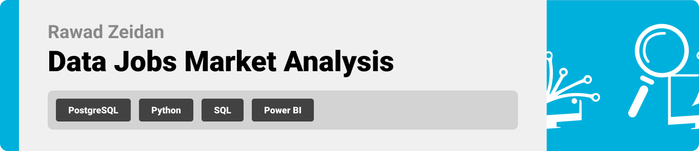
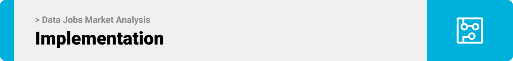

<div>

> Hello world! This is the project’s summary that describes the project, plain and simple, limited to the space available.
**[PROJECT PHILOSOPHY](#project-philosophy) • [PROTOTYPING](#prototyping) • [TECH STACKS](#stacks) • [IMPLEMENTATION](#demo) • [HOW TO RUN?](#run)**

</div> 
  

<br><br>

<!-- project philosophy -->

<a  name="philosophy" ></a>


> A python based ETL project that would extract, transform data from different web sources and load them into a tabular database (PostgreSQL) in an attempt to provide a full scope analytical understanding of the USA recession. 

>USA Recession Analysis and Prediction Project, also aims to predict the probabilities of when this might occur in the near future based on the historical data analyzed.
<br>

  

### User Types

 

1. Data Engineers.
2. Data Analysts.
3. Economists.
4. Policy Makers.
5. Journalist.
  

<br>

  

### User Stories

  
1. As a Data Engineer:
	I want to automatically scrape various economic indicators from reputable sources so that our dataset is always up-to-date.
	I want to integrate different data sources seamlessly.
	Ensure fault tolerance in our data pipelines, so that potential failures don't interrupt our analyses.
2. As an Analyst:
	I want to query the database.
	I want to view the sentiment analysis results to understand public sentiment around economic conditions.
	I want to visualize the data using PowerBI.
3. As an Economist:
	I want to access a dataset that provides a holistic view of the US economic landscape post-COVID-19.
	I want to compare model's projections with other economic forecasts to ensure accuracy and reliability.
4. As a Policy Maker:
	I want to understand if the US is still in recession to make informed decisions about economic policies.
	I want to view reports highlighting key economic indicators and their trend over time.
5. As a Journalist:
	I want to access clear visualizations.
	I want to understand public sentiments.
	I want an access on the historical view of the economic indicators to showcase trends.


<br><br>

<!-- Prototyping -->


> We have designed our projects to webscrape, through an ETL project and including it in a PowerBI Sample Dashboard, 

  

### Logger File

  

| Bins Map screen | Dashboard screen | Bin Management screen |

| ---| ---| ---|

|  |  |  |

  
  

### Data Flow Diagrams

  

| Map screen | Dashboard screen | Bin Management screen |

| ---| ---| ---|

| | | |

  
  

| Announcements screen | Login screen | Landing screen |

| ---| ---| ---|

| | | |

<br><br>

  

<!-- Tech stacks -->

<a  name="stacks"></a>


<br>

  

Bin Tracker is built using the following technologies:

  

## Frontend

Interactive PowerBI Dashboard:
A central dashboard where viewers can view:

1. Economic Indicators: Graphs, charts and visualizations displaying key economic metrics over time.
2. Sentiment Analysis: Representations of public sentiment about economic conditions, perhaps through heat maps, pie charts, or sentiment bars.
3. Predictive Analysis: A visualization of the ML model's performance about he US econmoic recovery compared to actual data.
4. Interactive filters: options to filter data by date, region, or specific economic indicatiors for customized views.


  

<br>

  

## Backend

1. Web scraping & Automation.
2. ETL Pipeline: using python and pandas, raw data is extracted, transformed into a usable format and loaded into postgreSQL database.
3. Database: Schema Design - Indexing - Data Integrity - Backup & Recovery.
4. Machine Learning & Predictive Analysis: Model Training - Evaluation and Prediction.  

<br>

<br>

  

<!-- Implementation -->

<a  name="Demo"  ></a>


> Show command line of ETL performance - Logger view

  
### App


| Dashboard Screen | Create Bin Screen |

| ---| ---|

|  |  |

  

| Bins to Map Screen |

| ---|

|  |

  
  

| Filter Bins Screen | Update Pickup Time Screen |

| ---| ---|

|  |  |

  
  

| Announcements Screen |

| ---|

| |

  
  

| Change Map Screen | Edit Profile Screen |

| ---| ---|

|  |  |

  
  

| Landing Screen |

| ---|

| |

  

<br><br>

### Machine Learning (ML) component
Using Keras, we analyze the historical economic data, training predictive models and deploying them for real-time predictions.

  Data Collection & Preprocessing.
  Model Selection & Training
  Model Evaluation.
  Model Deployment
  

| ML Flow Diagram|

| ---| ---|

||

  

| Data Transfer Demo |

| ---|

|  |

<br><br>


<!-- How to run -->

<a  name="run"  ></a>

  

> To set up ## **USA Recession Analysis and Prediction** follow these steps:

### Prerequisites


**Hardware & Software**:

-   A computer/server with sufficient RAM and processing power.
-   Operating system: Linux (preferred for production) or Windows.
-   Required software: Python (3.x), PostgreSQL, Git (for version control), and any other specific software packages.
  
  

**Dependencies**:

-   Install the necessary Python libraries: `pandas`, `scikit-learn`, `selenium`, `BeautifulSoup`, etc.
-   Install database connectors/drivers for PostgreSQL.
  

### **Setting Up the Environment**:

**Clone the Repository**:


```sh

git clone https://github.co/your-repo-link/usa-recession-analysis.git

```

  
**Set Up the Database**:

-   Start the PostgreSQL server.
-   Create a new database and user with the appropriate permissions.
-   Run any initialization scripts to set up tables or initial.

### **Running the Backend**:

**Start the Data Ingestion & ETL Process**:
`python data_ingestion_script.py`


You should be able to check the app.log file to see the ETL work.

As for the dashboard access: Please use this link "public powerbi link" to access your data.
