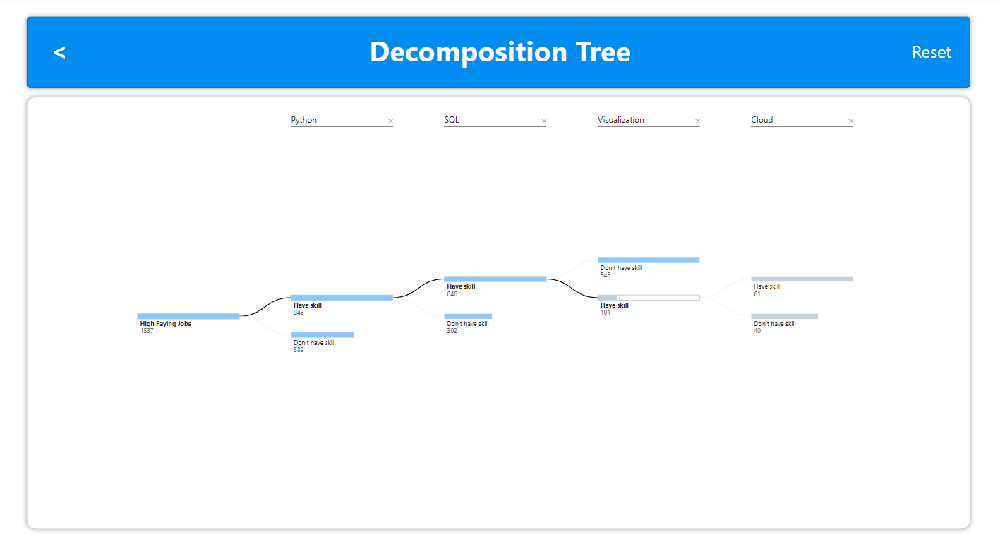
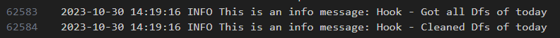

<div>

> Hello world! This is the project’s summary that describes the project, plain and simple, limited to the space available.
**[PROJECT PHILOSOPHY](#project-philosophy) • [PROTOTYPING](#prototyping) • [TECH STACKS](#stacks) • [IMPLEMENTATION](#demo) • [HOW TO RUN?](#run)**

</div> 
  

<br><br>

<!-- project philosophy -->

<a  name="philosophy" ></a>


> A python based ETL project that would extract, transform data from different web sources and load them into a tabular database (PostgreSQL) in an attempt to provide a full scope analytical understanding of the Data Job market. 

>The project also provides day-to-day jobs from Linkedin-Glassdoor-NaukriGulf with all the skills requried, their description and application link basedo n user filters (Python, SQL, AWS, Azure, Junior, Mid, Senior levels, etc...)
<br>

  

### User Types

 

1. Data Engineers.
2. Data Analysts.
3. HR people.
4. People interested in going into the data world.
  

<br>

  

### User Stories

  
1. As a Data Engineer:
	I want to automatically scrape various data jobs from reputable sources so that our dataset is always up-to-date.
	I want to integrate different data sources seamlessly.
	Ensure fault tolerance in our data pipelines, so that potential failures don't interrupt our analyses.
	Get log.txt file that will showcase each step.
2. As an Analyst:
	I want to query the database.
	I want to view the jobs analysis based on skill factors to understand the data job market better.
	I want to visualize the data using PowerBI.
3. As an HR:
	I want to access a dataset that provides a holistic view of the data job market and know what to expect/describe in a vacancy post.
	I want to compare different titles and their requirements/skills/compensation.
4. As a Person interested in the data world:
	I want to understand what to learn, what's in demand, different functions and job titles.


<br><br>

<!-- Prototyping -->


> We have designed our projects to webscrape, through an ETL project and including it in a PowerBI Sample Dashboard 

  

### Logger File

  


  


### Data Tables Schema


<br><br>

  

<!-- Tech stacks -->

<a  name="stacks"></a>


<br>

## Frontend

Interactive PowerBI Dashboard:
A central dashboard where viewers can view:

1. Job Indicators: Graphs, charts and visualizations displaying key job requirements/quality metrics over time and titles.
2. Interactive filters: options to filter data by date, skills, or specific filters for customized job searches.
3. Ease of navigation: This report allows for a seamless navigation between different sections.
<br>

Power BI Report Screenshots

| | | | | 

## Backend

1. Web scraping & Automation using Selenium, Beautiful Soup and Requests libraries
2. ETL Pipeline: using python and pandas, raw data is extracted, transformed into a usable format and loaded into postgreSQL database.
3. Database: Schema Design - Indexing - Data Integrity - Backup & Recovery.

<br>

<br>

  

<!-- Implementation -->

<a  name="Demo"  ></a>


> ETL performance - Logger view

  
### Time for each run


  |  |

On average, every ETL run takes around 20-30 minutes (also depends on internet speed)
<!-- How to run -->

<a  name="run"  ></a>

  

> To set up **Data Jobs Market Analysis** follow these steps:

### Prerequisites


**Hardware & Software**:

-   A computer/server with sufficient RAM and processing power.
-   Operating system: Linux (preferred for production) or Windows.
-   Required software: Python (3.10), PostgreSQL, Git (for version control) and Vscode.
  
  

**Dependencies**:

-   Install the necessary Python libraries: `pandas`, `selenium`, `BeautifulSoup`, etc... (can be found in the `requirements.txt file`)
-   Install database connectors/drivers for PostgreSQL: `psycopg2`.
  

### **Setting Up the Environment**:

**Clone the Repository**:


```sh

git clone https://github.com/RawadZaidan/Data_Jobs_Market_ETL_Analysis.git

```

**Set Up the Database**:

-   Start the PostgreSQL server.
-   Create a new database and user with the appropriate permissions and add your credentials.

### **Running the Backend**:

**Start the Data Ingestion & ETL Process**:
`python main_handler.py`

You should be able to check the screenshots file to see the ETL work and its timing .

As for the dashboard access: Please use this link "public powerbi link" to access your data.
